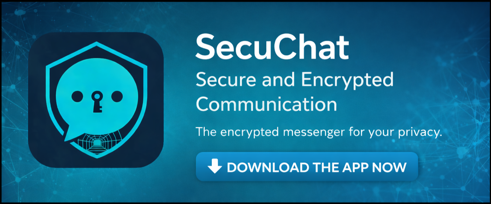

# SecuChat 🔒

<p align="center">
  
</p>

**Private messenger without servers, without metadata, without compromises.**

SecuChat is a cross-platform messaging app with end-to-end encryption (PGP) and anonymous routing via the I2P network. Your messages are only readable by you and your conversation partner – no one else can eavesdrop, not even us.

> ⚠️ **IMPORTANT NOTICE:** This app is still in active development and currently **not fully functional**. Basic features are implemented, but there are still bugs and incomplete features. Use at your own risk!

---

## ✨ Features

| Feature | Description |
|---------|-------------|
| 🔐 **True End-to-End Encryption** | All messages are encrypted with PGP (ECC curve25519) |
| 🕵️ **Anonymous Routing** | I2P network hides your IP address and metadata |
| 🖥️ **No Servers** | Your data stays on your device – no cloud, no accounts |
| 📁 **Contact Import** | Exchange contacts easily via `.secuchat` files |
| 🖼️ **File Uploads** | Send images and files (up to 50MB) encrypted |
| 📱 **Android Support** | Native Android app via Capacitor (direct TCP to SAM) |

---

## 📥 Download & Installation

### Android
1. Download the latest `.apk` from the [Releases page](https://github.com/weedo078/SecuChat/releases)
2. Install [i2pd](https://github.com/PurpleI2P/i2pd/releases) from F-Droid or GitHub
3. In i2pd settings: enable SAM (`SAM enabled = true`, port `7656`)
4. Open the SecuChat APK and grant install permissions
5. In SecuChat Settings → I2P: enable SAM, host `127.0.0.1`, port `7656`

### Windows
1. Download the latest version from the [Releases page](https://github.com/weedo078/SecuChat/releases)
2. Run the `.exe` file
3. SecuChat starts automatically (i2pd is already bundled)

### Linux
```bash
# Option 1: AppImage (works on all distributions)
chmod +x SecuChat-*.AppImage
./SecuChat-*.AppImage

# Option 2: Debian/Ubuntu
sudo dpkg -i secuchat_*.deb
```

> **Note:** i2pd is already included in the Windows installer. On Android and Linux, install i2pd separately.

---

## 🚀 First Steps

### 1. Start the App
On first launch, you create your profile:
- Choose a name
- Set a passphrase (protects your private keys)
- The app automatically generates your PGP and I2P keys

### 2. Add a Contact

**Received a contact file?**
1. Click "Add Contact" (UserPlus icon)
2. Upload the `.secuchat` file or paste the text
3. Done!

**Want to share your contact?**
1. Click "Share Contact" (Share icon)
2. Download your `.secuchat` file
3. Send it to your conversation partner (via email, messenger, etc.)

### 3. Send Messages
1. Select a contact from the list
2. Type your message
3. Press Enter or click the Send button

---

## 🔐 Security

SecuChat uses proven encryption technologies:

- **PGP (OpenPGP.js)** – Military-grade encryption for all messages
- **I2P** – Anonymous network that hides sender and recipient
- **Local Storage** – Your data never leaves your device
- **Password-Protected Keys** – AES-GCM encryption with PBKDF2

**What we cannot do:**
- ❌ Read your messages
- ❌ See your IP address
- ❌ Know your contacts
- ❌ Recover messages (no backups on servers)

---

## 🐛 Troubleshooting

### "I2P not connected"
- Wait 1-2 minutes after first start (i2pd builds initial connections)
- Check if ports 7656 and 7657 are free
- Restart the app

### "Message not delivered"
- Make sure both sides are online
- Check if the I2P address was imported correctly
- Try adding the contact again

### "Cannot import contact"
- The `.secuchat` file must be in JSON format
- Check if all characters were copied correctly

---

## 📄 License

GNU Affero General Public License v3.0 (AGPL-3.0)

SecuChat is Open Source. Anyone can view, verify, and improve the code.

---

## 🛠️ Contributing

Want to help? Check out [DEVELOPMENT.md](DEVELOPMENT.md) for details on the project structure.

**Found a bug?** Create an [Issue](https://github.com/weedo078/SecuChat/issues).
